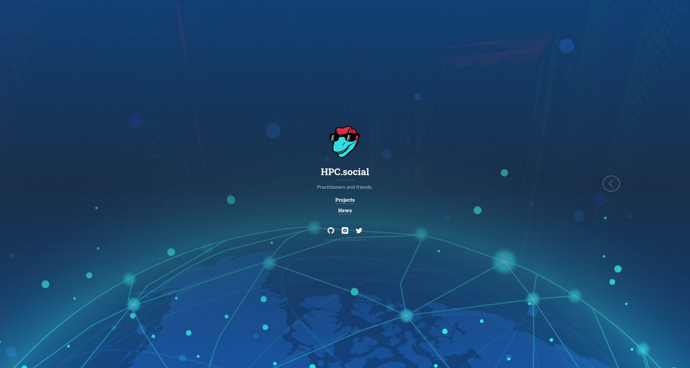

# hpc-social

<!-- ALL-CONTRIBUTORS-BADGE:START - Do not remove or modify this section -->

<!-- ALL-CONTRIBUTORS-BADGE:END -->

Welcome to the HPC Social site!

This is a portal for community resources and connection. It is currently
under development, and we welcome your contributions and feedback!

## 😁️ Contributors 😁️

We use the [all-contributors](https://github.com/all-contributors/all-contributors)
tool to generate a contributors graphic below.

<!-- ALL-CONTRIBUTORS-LIST:START - Do not remove or modify this section -->
<!-- prettier-ignore-start -->
<!-- markdownlint-disable -->
<table>
  <tbody>
    <tr>
      <td align="center" valign="top" width="14.28%"><a href="https://vsoch.github.io"> <b>Vanessasaurus</b></a> <a href="https://github.com/hpc-social/hpc-social.github.io/commits?author=vsoch" title="Code">💻</a></td>
      <td align="center" valign="top" width="14.28%"><a href="https://github.com/FCLC"> <b>FCLC</b></a> <a href="https://github.com/hpc-social/hpc-social.github.io/commits?author=FCLC" title="Code">💻</a></td>
      <td align="center" valign="top" width="14.28%"><a href="nsfcac.org or www.depts.ttu.edu/hpcc/"> <b>Alan Sill</b></a> <a href="https://github.com/hpc-social/hpc-social.github.io/commits?author=alansill" title="Code">💻</a></td>
      <td align="center" valign="top" width="14.28%"><a href="https://github.com/brandonbiggs"> <b>Brandon Biggs</b></a> <a href="https://github.com/hpc-social/hpc-social.github.io/commits?author=brandonbiggs" title="Code">💻</a></td>
    </tr>
  </tbody>
</table>

<!-- markdownlint-restore -->
<!-- prettier-ignore-end -->

<!-- ALL-CONTRIBUTORS-LIST:END -->

## 🎨️ Thanks 🎨️

- This is derived from [hydejack](https://github.com/hydecorp/hydejack)
and maintains the original open source [LICENSE](LICENSE).
- The background image on the opening page is provided by [rawpixel on Freepik](https://www.freepik.com/free-vector/worldwide-connection-blue-background-illustration-vector_3842188.htm#query=data%20center&position=39&from_view=search&track=sph#position=39&query=data%20center)
